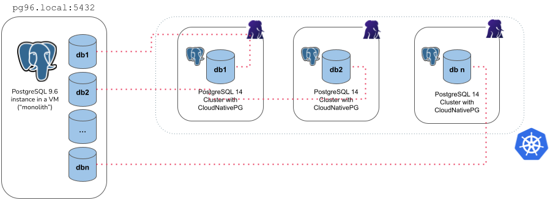
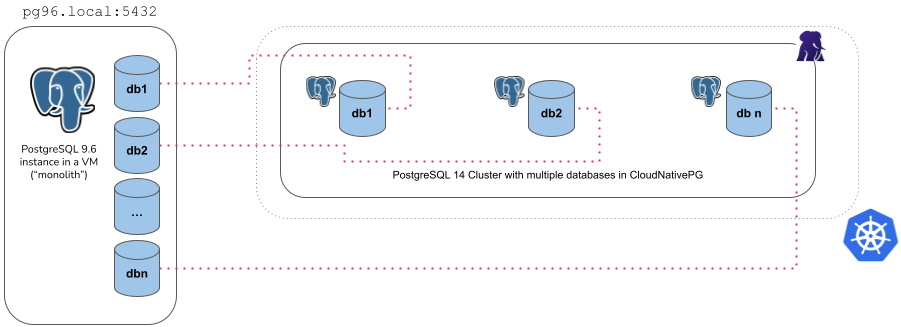

# Importing Postgres databases

This section describes how to import one or more existing PostgreSQL
databases inside a brand new CloudNativePG instance.

The import operation is based on the concept of online logical backups in PostgreSQL,
and relies on `pg_dump` and `pg_restore`, via a network connection.
Thanks to native Multi-Version Concurrency Control (MVCC) and snapshots,
PostgreSQL enables taking consistent backups over the network, in a concurrent
manner, without stopping any write activity. Logical backups are also the most
common, flexible and reliable technique to perform major upgrades of PostgreSQL
versions.

As a result, the instructions in this section are suitable for both:

- importing one or more databases from an existing PostgreSQL instance, even
  outside Kubernetes
- importing the database from any PostgreSQL version to one that is either the
  same or newer, enabling *major upgrades*

!!! Warning
    When performing major upgrades of PostgreSQL you are responsible for making
    sure that the upgrade path of the objects contained in the database (including
    extensions) is possible.

In both cases, the operation is performed on a snapshot of the origin database.

!!! Important
    For this reason we suggest to stop write operations on the source before
    the final import in the `Cluster` resource - hence why this feature is
    referred to as "offline import" or "offline major upgrade".

## How it works

Conceptually, the import requires you to create a new cluster from scratch
(*destination cluster*), using the [`initdb` bootstrap method](bootstrap.md),
and then complete the `initdb.import` subsection to import objects from an
existing Postgres cluster (*source cluster*). As per PostgreSQL recommendation,
we suggest that the PostgreSQL major version of the *destination cluster* is
greater or equal than the one of the *source cluster*.

CloudNativePG provides two main ways to import objects from the source cluster
into the destination cluster:

- **microservice approach**: the destination cluster is designed to host a
  single application database owned by the specified application user, as
  recommended by the CloudNativePG project

- **monolith approach**: the destination cluster is designed to host multiple
  databases and different users, imported from the source cluster

The first import method is available via the `microservice` type, while the
latter by the `monolith` type.

## The `microservice` type

With the microservice approach, you can specify a single database you want to
import from the source cluster into the destination cluster. The operation is
performed in 4 steps:

- `initdb` bootstrap of the new cluster
- export of the selected database (in `initdb.import.databases`) using
  `pg_dump -Fc`
- import of the database using `pg_restore --no-acl --no-owner` into the
  `initdb.database` (application database) owned by the `initdb.owner` user
- optional execution of the user defined SQL queries in the application
  database via the `postImportApplicationSQL` parameter



For example, the YAML below creates a new 3 instance PostgreSQL cluster (latest
available major version) called `cluster-microservice` that imports the `angus`
database from the `cluster-pg96` cluster (with the unsupported PostgreSQL 9.6),
by connecting to the `postgres` database using the `postgres` user, via the
password stored in the `cluster-pg96-superuser` secret.

```yaml
apiVersion: postgresql.cnpg.io/v1
kind: Cluster
metadata:
  name: cluster-microservice
spec:
  instances: 3

  bootstrap:
    initdb:
      import:
        type: microservice
        databases:
          - angus
        source:
          externalCluster: cluster-pg96
        # postImportApplicationSQL:
        # - "INSERT YOUR SQL QUERIES HERE"
  storage:
    size: 1Gi
  externalClusters:
    - name: cluster-pg96
      connectionParameters:
        # Use the correct IP or host name for the source database
        host: pg96.local
        user: postgres
        dbname: postgres
      password:
        name: cluster-pg96-superuser
        key: password
```


There are a few things you need to be aware of when using the `microservice` type:

- It requires an `externalCluster` that points to an existing PostgreSQL
  instance containing the data to import
- Traffic must be allowed between the Kubernetes cluster and the
  `externalCluster` during the operation
- Connection to the source database must be granted with the specified user
  that needs to run `pg_dump` and read roles information (*superuser* is
  OK)
- Currently, the `pg_dump -Fc` result is stored temporarily inside an empty
  directory of the import job, so there should be enough available space to
  temporarily contain the dump result on the assigned node
- Only one database can be specified inside the `initdb.import.databases` array
- Roles are not imported - and as such they cannot be specified inside `initdb.import.roles`

## The `monolith` type

With the monolith approach, you can specify a set of roles and databases you
want to import from the source cluster into the destination cluster.

<!--
The operation is performed in the following steps: TODO

-->



For example, the YAML below creates a new 3 instance PostgreSQL cluster (latest
available major version) called `cluster-microservice` that imports the
`accountant` and the `bank_user` roles, as well as the `accounting`, `banking`,
`resort` databases from the `cluster-pg96` cluster (with the unsupported
PostgreSQL 9.6), by connecting to the `postgres` database using the `postgres`
user, via the password stored in the `cluster-pg96-superuser` secret.

```yaml
apiVersion: postgresql.cnpg.io/v1
kind: Cluster
metadata:
  name: cluster-monolith
spec:
  instances: 3
  bootstrap:
    initdb:
      import:
        type: monolith
        databases:
          - accounting
          - banking
          - resort
        roles:
          - accountant
          - bank_user
        source:
          externalCluster: cluster-example
  storage:
    size: 1Gi
  externalClusters:
    - name: cluster-pg96
      connectionParameters:
        # Use the correct IP or host name for the source database
        host: pg96.local
        user: postgres
        dbname: postgres
      password:
        name: cluster-pg96-superuser
        key: password
```

There are a few things you need to be aware of when using the `monolith` type:

- It requires an `externalCluster` that points to an existing PostgreSQL
  instance containing the data to import
- Traffic must be allowed between the Kubernetes cluster and the
  `externalCluster` during the operation
- Connection to the source database must be granted with the specified user
  that needs to run `pg_dump` and retrieve roles information (*superuser* is
  OK)
- Currently, the `pg_dump -Fc` result is stored temporarily inside an empty
  directory of the import job, so there should be enough available space to
  temporarily contain the dump result on the assigned node
- At least one database to be specified in the `initdb.import.databases` array
- Any role that is required by the imported databases must be specified inside
  `initdb.import.roles`, if the limitations below:
    - The following roles, if present, are not imported: `postgres`, `streaming_replica`, `cnp_pooler_pgbouncer`
    - The `SUPERUSER` option is removed from any imported role
- Wildcard `"*"` can be used as the only element in the `databases` and/or
  `roles` arrays to import every object of the kind
- After the clone procedure is done, `ANALYZE VERBOSE` is executed for every
  database.
- `postImportApplicationSQL` field is not supported
